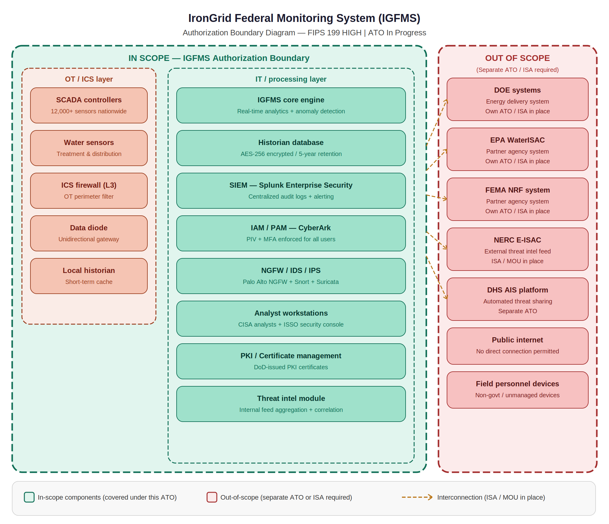
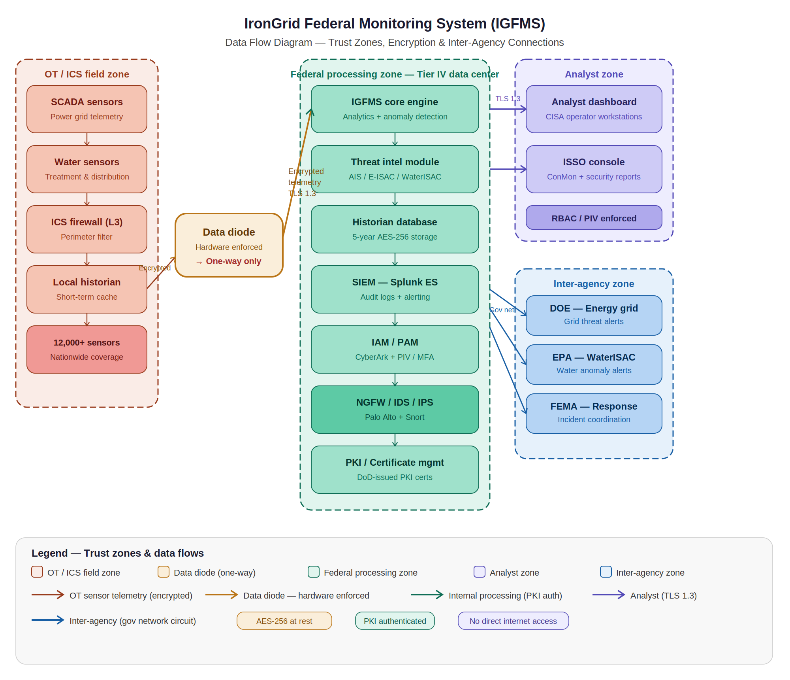

System Boundary & Data Flow
IronGrid Federal Monitoring System (IGFMS)
Document Type: System Boundary Definition
Version: 1.1
Classification: UNCLASSIFIED // FOR OFFICIAL USE ONLY (FOUO) (fictional)
Date: January 2025
Reference: NIST SP 800-18 Rev 1, NIST SP 800-37 Rev 2

---

1. Authorization Boundary Definition
The IGFMS authorization boundary defines all assets — hardware, software, data, personnel, and facilities — that are covered under this system's Authority to Operate (ATO). All components within this boundary are subject to the security controls documented in this SSP.

1.1 In-Scope Components
OT / ICS Layer (within boundary):
12,000+ SCADA sensors and controllers at power substations nationwide
Water treatment and distribution monitoring sensors
ICS firewall (Layer 3) — OT perimeter protection
Hardware data diode appliances — unidirectional gateways
Local ICS historian — short-term telemetry cache
IT / Processing Layer (within boundary):
IGFMS Core Processing Engine — analytics and anomaly detection
Historian database — 5-year AES-256 encrypted telemetry storage
SIEM platform (Splunk Enterprise Security)
IAM/PAM system (CyberArk)
NGFW / IDS / IPS (Palo Alto + Snort + Suricata)
Analyst workstations — CISA operator and ISSO consoles
PKI / certificate management infrastructure
Threat intelligence aggregation module
All associated network infrastructure within the data center
1.2 Out-of-Scope Components
The following systems operate under separate ATOs and are considered external interconnections. Data exchange is governed by Interconnection Security Agreements (ISAs):
System	Agency	ATO Status
Energy Delivery System	Dept. of Energy	Separate ATO — ISA in place
WaterISAC Platform	EPA	Separate ATO — ISA in place
FEMA NRF System	FEMA	Separate ATO — ISA in place
NERC E-ISAC	NERC	Separate ATO — MOU in place
DHS AIS Platform	DHS	Separate internal ATO
Public Internet	N/A	No connection permitted
Field personnel personal devices	N/A	Non-government, unmanaged

---

2. Data Flow Description

2.1 Inbound Data Flows
Flow	Source	Destination	Protocol	Encryption
OT sensor telemetry	SCADA sensors (field)	ICS Historian → Data diode	Proprietary ICS protocol	AES-256
Threat intelligence	AIS, E-ISAC, WaterISAC	Threat Intel Module	STIX/TAXII over TLS 1.3	TLS 1.3
Analyst authentication	Active Directory / PKI	IAM/PAM	Kerberos + PKI	TLS 1.3
2.2 Internal Data Flows
Flow	Source	Destination	Encryption
Processed telemetry	Core Engine	Historian DB	AES-256 in transit + at rest
Security events	All systems	SIEM (Splunk)	TLS 1.3
Privileged sessions	Analysts / Admins	CyberArk PAM	AES-256 session recording
Alerts	Core Engine / SIEM	Analyst Dashboard	TLS 1.3
2.3 Outbound Data Flows
Flow	Source	Destination	Protocol	Encryption
Grid threat alerts	Core Engine	DOE EDS	REST API over TLS 1.3	TLS 1.3
Water anomaly alerts	Core Engine	EPA WaterISAC	REST API over TLS 1.3	TLS 1.3
Incident coordination	ISSO Console	FEMA NRF	Encrypted messaging	TLS 1.3
Monthly ConMon reports	ISSO Console	AO / ISSM	Secure email / portal	S/MIME
2.4 Data Diode Operation
The hardware data diode appliances enforce strict unidirectional data flow from the OT/ICS sensor network to the IT processing tier. These appliances use optical transmission technology that physically prevents any return path — no TCP/IP acknowledgments, no bidirectional protocols. This ensures that a compromise of the IT tier cannot propagate back into the OT environment and vice versa.

---

3. Trust Zones
Zone	Trust Level	Components
OT / ICS field zone	Lowest trust (isolated)	SCADA sensors, ICS firewall
Data diode boundary	Enforced one-way	Hardware unidirectional gateway
Federal processing core	High trust (controlled)	Core engine, SIEM, DB, IAM
Analyst zone	Controlled trust (authenticated)	CISA workstations, ISSO console
Inter-agency zone	External trust (ISA governed)	DOE, EPA, FEMA connections
Internet	Untrusted (no connection)	Not connected
