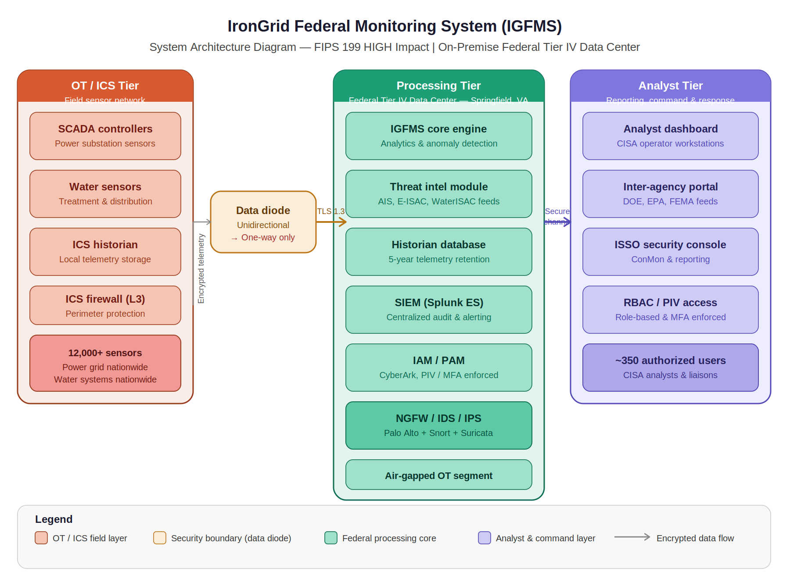
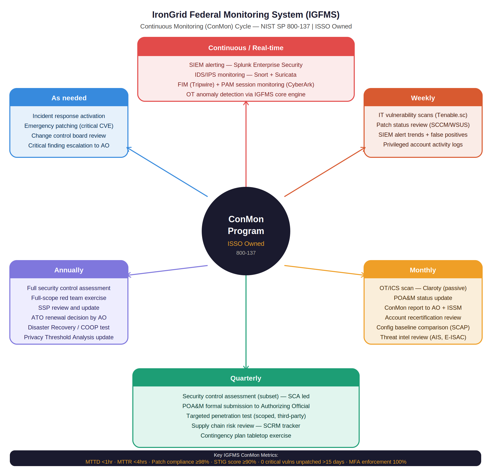

System Security Plan (SSP)
IronGrid Federal Monitoring System (IGFMS)
Document Type: System Security Plan
Version: 2.1
Classification: UNCLASSIFIED // FOR OFFICIAL USE ONLY (FOUO) (fictional)
Date: January 2025
Prepared By: ISSO, IronGrid Federal Program Office (fictional)
Reviewed By: ISSM, DHS CISA Cybersecurity Division (fictional)
Reference: NIST SP 800-18 Rev 1 — Guide for Developing Security Plans

---


---

1. System Identification
Field	Details
System Name	IronGrid Federal Monitoring System (IGFMS)
System Abbreviation	IGFMS
System Identifier	DHS-CISA-IGFMS-001 (fictional)
System Version	3.2.1
Responsible Organization	U.S. Department of Homeland Security — CISA (fictional)
System Owner	James A. Harlow, Deputy Director of Infrastructure Assurance (fictional)
ISSO	[patrickobu]
ISSM	Sarah K. Reyes, ISSM (fictional)
Authorizing Official	Lt. Gen. (Ret.) Marcus T. Webb (fictional)
System Type	Major Application
Operating Status	Operational

System Environment	On-Premise Federal Tier IV Data Center, Springfield, VA (fictional)

---

2. System Overview
The IronGrid Federal Monitoring System (IGFMS) is a mission-critical federal information system operated by the U.S. Department of Homeland Security (DHS), Cybersecurity and Infrastructure Security Agency (CISA). IGFMS provides real-time monitoring, alerting, and situational awareness for the national power grid and water systems infrastructure across the 48 contiguous United States.
IGFMS serves as the primary sensor fusion and situational awareness platform for CISA analysts, aggregating telemetry from more than 12,000 Industrial Control System (ICS) and SCADA sensors deployed across power substations and water treatment facilities nationwide. The system enables rapid detection of cyber-physical threats, supports inter-agency incident coordination, and maintains historical data for forensic analysis.
2.1 System Purpose
IGFMS fulfills the following critical mission functions:
Real-time telemetry ingestion from ICS/SCADA sensors across power and water infrastructure
Automated anomaly detection and threat alerting for cyber-physical attack indicators
Centralized situational awareness dashboard for CISA analysts and incident commanders
Secure inter-agency data sharing with DOE, EPA, and FEMA
Historical telemetry storage and forensic analysis capability
Threat intelligence integration with AIS, E-ISAC, and WaterISAC
2.2 System Boundaries
The IGFMS authorization boundary encompasses all hardware, software, data, and communications within the federal data center hosting environment, including the OT/ICS sensor ingestion layer, core processing engine, historian database, SIEM platform, IAM/PAM systems, analyst workstations, and associated network infrastructure.
Systems operating under separate Authorities to Operate (ATOs) — including DOE Energy Delivery Systems, EPA WaterISAC, FEMA National Response Framework systems, and DHS AIS — are considered external interconnections and are governed by Interconnection Security Agreements (ISAs).

---


---

3. System Environment
3.1 Hardware Components
Component	Description	Quantity
Sensor ingestion servers	Dell PowerEdge R750 — OT data aggregation	12
Core processing servers	Dell PowerEdge R860 — analytics engine	8
Historian database servers	NetApp AFF A800 — long-term storage	4
SIEM servers	Splunk Enterprise cluster nodes	6
Analyst workstations	Dell OptiPlex 7090 — CISA operator stations	60
Network infrastructure	Cisco Catalyst 9500 switches + Palo Alto PA-5450 NGFW	Various
Data diode appliances	Waterfall Security Unidirectional Gateway	4
Backup systems	Commvault HyperScale X — backup + recovery	2
3.2 Software Components
Software	Function	Version
IGFMS Core Engine	Real-time analytics + anomaly detection	3.2.1
Splunk Enterprise Security	SIEM + centralized audit logging	9.2
CyberArk Privileged Access Manager	PAM + privileged session management	14.0
Claroty Platform	Passive OT/ICS vulnerability scanning	4.5
Tenable.sc	IT vulnerability scanning	6.2
Tripwire Enterprise	File integrity monitoring	9.1
Active Directory	Directory services + authentication	Windows Server 2022
RHEL	Server operating system	9.3
Windows 11	Analyst workstation OS	23H2
3.3 Network Architecture
IGFMS operates across three physically separated network tiers enforced by hardware data diodes:
Tier 1 — OT/ICS Sensor Network: Air-gapped operational technology segment receiving telemetry from field sensors. No inbound connectivity permitted. Data flows outbound only through hardware-enforced unidirectional gateways.
Tier 2 — Federal Processing Core: On-premise federal Tier IV data center hosting all core processing, storage, SIEM, and IAM functions. Connected to Tier 3 via encrypted, authenticated internal network segments.
Tier 3 — Analyst and Reporting Layer: Secure analyst workstations, ISSO security console, and inter-agency portal connections via dedicated government network circuits.

---


---

4. System Interconnections
Connected System	Agency	Data Exchanged	Agreement	Method
Energy Delivery System (EDS)	Dept. of Energy	Grid threat alerts, status data	ISA-DHS-DOE-001	TLS 1.3 / Gov network
WaterISAC Platform	EPA	Water anomaly alerts, threat intel	ISA-DHS-EPA-001	TLS 1.3 / Gov network
National Response Framework System	FEMA	Incident coordination data	ISA-DHS-FEMA-001	Encrypted messaging
Automated Indicator Sharing (AIS)	DHS	STIX/TAXII threat indicators	Internal DHS agreement	TLS 1.3
E-ISAC Platform	NERC	Electricity sector threat intel	MOU-DHS-NERC-001	Encrypted feeds

---

5. Applicable Laws, Regulations, and Standards
Law / Regulation / Standard	Applicability
Federal Information Security Modernization Act (FISMA) 2014	Primary compliance driver — mandatory
NIST SP 800-53 Rev 5 (HIGH Baseline)	Primary control framework
NIST SP 800-82 Rev 3	ICS/OT-specific security controls
NIST SP 800-161 Rev 1	Supply chain risk management
NIST SP 800-137	Continuous monitoring strategy
NIST Cybersecurity Framework (CSF) 2.0	Framework alignment
FIPS 199 / FIPS 200	System categorization + minimum requirements
Executive Order 14028	Improving the Nation's Cybersecurity
Presidential Policy Directive 21 (PPD-21)	Critical infrastructure resilience
OMB Circular A-130	Federal information management
NERC CIP Standards	Reference alignment for power grid security

---

6. Security Control Summary
6.1 Security Categorization
Per FIPS 199, IGFMS is categorized as HIGH impact across all three security objectives:

```

SC IGFMS = {(Confidentiality, HIGH), (Integrity, HIGH), (Availability, HIGH)}

```

6.2 Control Baseline
IGFMS implements the NIST SP 800-53 Rev 5 HIGH baseline (~421 controls), supplemented by NIST SP 800-82 ICS overlays and NIST SP 800-161 supply chain risk management controls.
Control Family	Abbrev.	Controls Selected
Access Control	AC	25
Awareness and Training	AT	6
Audit and Accountability	AU	16
Security Assessment	CA	9
Configuration Management	CM	14
Contingency Planning	CP	13
Identification and Authentication	IA	12
Incident Response	IR	10
Maintenance	MA	6
Media Protection	MP	9
Physical and Environmental	PE	21
Planning	PL	11
Program Management	PM	32
Personnel Security	PS	9
Privacy	PT	18
Risk Assessment	RA	10
System and Services Acquisition	SA	23
System and Communications	SC	51
System and Information Integrity	SI	23
Supply Chain Risk Management	SR	12
ICS/OT Overlays (800-82)	—	20
Total		~421

---

7. Minimum Security Requirements
Per FIPS 200, IGFMS meets or exceeds all 17 minimum security requirement areas:
Requirement Area	Status
Access Control	Implemented — PIV/MFA enforced, RBAC applied
Awareness and Training	Implemented — annual training + role-based OT training
Audit and Accountability	Implemented — Splunk SIEM, 5-year retention
Certification, Accreditation, and Security Assessments	In Progress — ATO package under review
Configuration Management	Implemented — STIG compliance, CCB process active
Contingency Planning	Implemented — BCP/DR tested annually
Identification and Authentication	Implemented — PIV + MFA for all privileged accounts
Incident Response	Implemented — IR plan, playbooks, SOC 24/7
Maintenance	Implemented — controlled maintenance procedures
Media Protection	Implemented — encrypted media, sanitization procedures
Physical and Environmental Protection	Implemented — Tier IV data center, biometric access
Planning	Implemented — SSP, PIA, Rules of Behavior
Personnel Security	Implemented — background investigations, termination procedures
Risk Assessment	Implemented — annual RA, continuous vulnerability scanning
System and Services Acquisition	Implemented — secure SDLC, supply chain controls
System and Communications Protection	Implemented — data diodes, TLS 1.3, encryption at rest
System and Information Integrity	In Progress — POAM-001 (firmware patching) active

---

8. Roles and Responsibilities

Role	Individual	Responsibility
Authorizing Official (AO)	Lt. Gen. (Ret.) Marcus T. Webb (fictional)	Issues ATO, accepts residual risk
System Owner (SO)	James A. Harlow (fictional)	Resources system, sponsors ATO
ISSM	Sarah K. Reyes (fictional)	Program-level security oversight
ISSO	[patrickobu]	Day-to-day security operations, ConMon, POA&M
Security Control Assessor (SCA)	Third-party independent assessor	Annual control assessment, SAP/SAR
SOC	CISA Security Operations Center	24/7 monitoring, incident detection
System Administrator	OT/IT Admin Team	Patch management, configuration
IAM Team	Identity & Access Management	Account lifecycle, MFA enforcement

---

9. Security Controls Implementation Status
9.1 Summary
Status	Count	Percentage
Fully Implemented	368	87%
Partially Implemented	38	9%
Planned (POA&M)	10	2%
Not Applicable	5	1%
Total	421	100%
9.2 Key Control Implementation Highlights
AC-2 — Account Management: All user accounts are managed through Active Directory with CyberArk PAM enforcing privileged access. Account reviews conducted quarterly. Automated provisioning/deprovisioning tied to HR system. 12 stale contractor accounts identified and suspended (POAM-006).
AC-17 — Remote Access: Remote access strictly prohibited for OT segment. IT segment remote access requires PIV authentication, VPN with MFA, and privileged access workstation (PAW). All remote sessions logged in CyberArk.
AU-2 — Event Logging: All systems forward audit logs to Splunk Enterprise Security. Log retention set to 5 years per federal records requirements. Known gap: Historian DB syslog forwarding misconfigured (POAM-004 — remediation in progress).
IA-2(1) — MFA for Privileged Accounts: PIV card + PIN enforced for all privileged administrator accounts. 18 of 23 accounts fully enrolled. Remaining 5 contractor accounts pending enrollment (POAM-002).
SC-7 — Boundary Protection: Hardware data diodes enforce unidirectional flow from OT to IT segment. Palo Alto PA-5450 NGFW with application-aware inspection deployed at all IT/inter-agency boundaries. Zero direct internet connectivity.
SC-28 — Protection of Information at Rest: All data at rest encrypted with AES-256. Historian database, backup systems, and analyst workstations all encrypted. Key management via HSM.
SI-2 — Flaw Remediation: Critical patches applied within 15 days (IT). OT patching follows vendor-approved procedures with AO risk acceptance for operational downtime. Legacy SCADA firmware remediation in progress (POAM-001).

---

10. Plan of Action and Milestones Summary
Active POA&M items are maintained in `06-POA&M/poam-tracker.md`. As of Q1 2025:
Severity	Open	In Progress	Total Active
Critical	1	2	3
High	3	2	5
Moderate	4	5	9
Low	2	3	5
Total	10	12	22

---

11. Continuous Monitoring Strategy
IGFMS implements a comprehensive continuous monitoring program per NIST SP 800-137. See `08-Continuous-Monitoring/conmon-plan.md` for full details.

Key monitoring activities include real-time SIEM alerting, weekly IT vulnerability scans, monthly OT passive scans, quarterly control assessments, and annual full red team exercises. Monthly ConMon reports are submitted to the AO and ISSM.

---

12. Document Approval
Role	Name	Signature	Date
System Owner	James A. Harlow	(signed)	January 2025
ISSO	[patrickobu]	(signed)	January 2025
ISSM	Sarah K. Reyes	(signed)	January 2025
Authorizing Official	Lt. Gen. (Ret.) Marcus T. Webb	(pending)	Pending ATO

---

13. References
NIST SP 800-18 Rev 1 — Guide for Developing Security Plans
NIST SP 800-53 Rev 5 — Security and Privacy Controls
NIST SP 800-37 Rev 2 — Risk Management Framework
NIST SP 800-82 Rev 3 — Guide to OT Security
FIPS 199 — Standards for Security Categorization
FIPS 200 — Minimum Security Requirements
