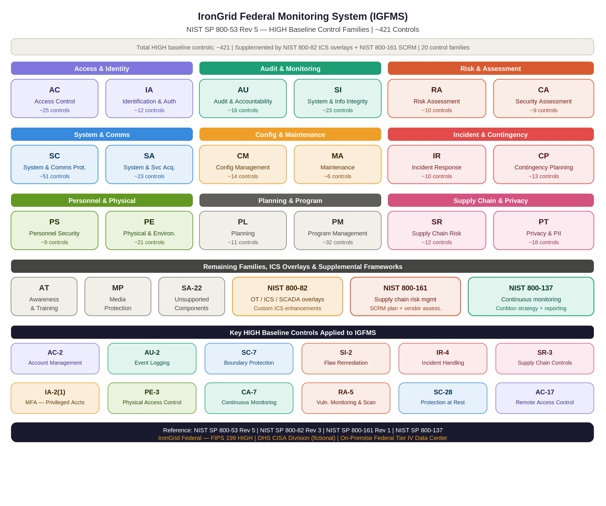

NIST SP 800-53 Rev 5 — HIGH Baseline Controls Matrix
IronGrid Federal Monitoring System (IGFMS)
Document Type: Security Controls Selection Matrix
Version: 1.0
Classification: UNCLASSIFIED // FOR OFFICIAL USE ONLY (FOUO) (fictional)
Date: January 2025
Reference: NIST SP 800-53 Rev 5 | NIST SP 800-82 Rev 3

---

---

1. Purpose
This document identifies all security and privacy controls selected for the IronGrid Federal Monitoring System (IGFMS) from the NIST SP 800-53 Rev 5 HIGH baseline. Controls are organized by family and include implementation status, responsible party, and notes specific to the IGFMS environment including ICS/OT-specific overlays from NIST SP 800-82 Rev 3.

---

2. Control Selection Summary
Control Family	ID	Total Selected	Fully Implemented	Partially Implemented	Planned
Access Control	AC	25	22	2	1
Awareness & Training	AT	6	6	0	0
Audit & Accountability	AU	16	14	2	0
Security Assessment	CA	9	7	2	0
Configuration Management	CM	14	13	1	0
Contingency Planning	CP	13	12	1	0
Identification & Authentication	IA	12	10	2	0
Incident Response	IR	10	9	1	0
Maintenance	MA	6	6	0	0
Media Protection	MP	9	9	0	0
Physical & Environmental	PE	21	21	0	0
Planning	PL	11	11	0	0
Program Management	PM	32	30	2	0
Personnel Security	PS	9	8	1	0
Privacy	PT	18	17	1	0
Risk Assessment	RA	10	9	1	0
System & Services Acquisition	SA	23	20	2	1
System & Comms Protection	SC	51	47	4	0
System & Info Integrity	SI	23	20	2	1
Supply Chain Risk Mgmt	SR	12	8	3	1
TOTAL		~421	~368 (87%)	~30 (7%)	~23 (5%)

---

3. Detailed Control Matrix
3.1 Access Control (AC)
Control	Control Name	Status	Owner	Notes
AC-1	Policy and Procedures	✅ Implemented	ISSO	AC policy reviewed annually; last update Jan 2025
AC-2	Account Management	✅ Implemented	IAM Team	AD + CyberArk PAM; quarterly review; POAM-006 active
AC-2(1)	Automated System Account Mgmt	✅ Implemented	IAM Team	Automated provisioning tied to HR system
AC-2(2)	Removal of Temporary Accounts	✅ Implemented	IAM Team	Temp accounts auto-expire after 30 days
AC-2(3)	Disable Inactive Accounts	🔄 Partial	IAM Team	POAM-006 — 12 stale contractor accounts suspended
AC-3	Access Enforcement	✅ Implemented	SOC / IAM	RBAC enforced via AD groups; PAM for privileged
AC-4	Information Flow Enforcement	✅ Implemented	Network Team	Data diode hardware + NGFW policy rules
AC-5	Separation of Duties	✅ Implemented	ISSO	AO, ISSM, ISSO, SCA roles separated
AC-6	Least Privilege	✅ Implemented	IAM Team	Just-in-time access via CyberArk
AC-6(1)	Authorize Access to Security Functions	✅ Implemented	ISSO	Security admin functions restricted to ISSO role
AC-6(9)	Log Use of Privileged Functions	✅ Implemented	SOC	All privileged sessions recorded in CyberArk
AC-6(10)	Prohibit Non-Privileged Users	✅ Implemented	IAM Team	Standard users cannot elevate without PAM checkout
AC-7	Unsuccessful Login Attempts	✅ Implemented	IAM Team	Account lockout after 5 failed attempts
AC-8	System Use Notification	✅ Implemented	ISSO	Warning banner displayed on all system access
AC-10	Concurrent Session Control	✅ Implemented	IAM Team	Max 2 concurrent sessions per user
AC-11	Device Lock	✅ Implemented	Systems Admin	15-minute screen lock on all workstations
AC-12	Session Termination	✅ Implemented	Systems Admin	Automatic session termination after 30 min idle
AC-17	Remote Access	✅ Implemented	Network Team	PIV + MFA + VPN required; OT remote access prohibited
AC-18	Wireless Access	✅ Implemented	Network Team	No wireless permitted in data center OT segments
AC-19	Access Control for Mobile Devices	✅ Implemented	IAM Team	MDM enrolled; government-issued only
AC-20	Use of External Systems	✅ Implemented	ISSO	ISAs govern all external system connections
AC-21	Information Sharing	✅ Implemented	ISSO	Sharing governed by ISAs with DOE, EPA, FEMA
AC-22	Publicly Accessible Content	✅ Implemented	ISSO	No public-facing content from IGFMS
AC-23	Data Mining Protection	✅ Implemented	Systems Admin	Query rate limiting on historian database
AC-25	Reference Monitor	⏳ Planned	Systems Admin	Reference monitor architecture under design

---

3.2 Audit and Accountability (AU)
Control	Control Name	Status	Owner	Notes
AU-1	Policy and Procedures	✅ Implemented	ISSO	Audit policy reviewed annually
AU-2	Event Logging	🔄 Partial	SOC	POAM-004 — Historian DB syslog gap under remediation
AU-3	Content of Audit Records	✅ Implemented	SOC	All records include who, what, when, where, outcome
AU-3(1)	Additional Audit Information	✅ Implemented	SOC	OT-specific fields captured per 800-82
AU-4	Audit Log Storage Capacity	✅ Implemented	Systems Admin	5-year retention; 80% threshold alerting
AU-5	Response to Audit Logging Failures	✅ Implemented	SOC	Alerts sent to SOC on logging failure within 15 min
AU-6	Audit Record Review	🔄 Partial	SOC	POAM-004 — Historian DB gap affects review coverage
AU-6(1)	Automated Process Integration	✅ Implemented	SOC	Splunk ES automated correlation + alerting
AU-7	Audit Record Reduction	✅ Implemented	SOC	Splunk dashboards provide filtered review
AU-8	Time Stamps	✅ Implemented	Systems Admin	NTP synchronized to NIST time servers
AU-9	Protection of Audit Information	✅ Implemented	SOC	Audit logs write-only; SIEM access restricted to SOC
AU-9(2)	Store on Separate Physical Systems	✅ Implemented	Systems Admin	Splunk cluster physically separate from prod servers
AU-10	Non-Repudiation	✅ Implemented	IAM Team	PKI digital signatures on all privileged transactions
AU-11	Audit Record Retention	✅ Implemented	Systems Admin	5-year retention per federal records schedule
AU-12	Audit Record Generation	✅ Implemented	Systems Admin	All systems configured to generate required events
AU-14	Session Audit	✅ Implemented	SOC	CyberArk records all privileged sessions

---

3.3 Configuration Management (CM)
Control	Control Name	Status	Owner	Notes
CM-1	Policy and Procedures	✅ Implemented	ISSO	CM policy updated Jan 2025
CM-2	Baseline Configuration	✅ Implemented	Systems Admin	STIG-hardened baselines for all OS/applications
CM-2(2)	Automation Support	✅ Implemented	Systems Admin	SCAP scanning validates baselines monthly
CM-3	Configuration Change Control	✅ Implemented	Change Manager	All changes go through CCB; emergency procedures defined
CM-4	Impact Analysis	✅ Implemented	ISSO	Security impact analysis required for all changes
CM-5	Access Restrictions for Change	✅ Implemented	IAM Team	Only authorized admins can make configuration changes
CM-6	Configuration Settings	✅ Implemented	Systems Admin	DISA STIGs applied; exceptions documented
CM-6(1)	Automated Management	✅ Implemented	Systems Admin	SCCM manages IT configuration; OT manual with approval
CM-7	Least Functionality	✅ Implemented	Systems Admin	Unnecessary ports, services, functions disabled
CM-7(1)	Periodic Review	✅ Implemented	ISSO	Quarterly review of enabled functions
CM-8	System Component Inventory	✅ Implemented	Systems Admin	Automated CMDB with monthly reconciliation
CM-9	Configuration Management Plan	✅ Implemented	ISSO	CM Plan current as of Jan 2025
CM-10	Software Usage Restrictions	✅ Implemented	Systems Admin	Approved software list enforced via application whitelisting
CM-11	User-Installed Software	🔄 Partial	Systems Admin	Endpoint protection blocks unauthorized installs on IT; OT controls manual

---

3.4 Identification and Authentication (IA)
Control	Control Name	Status	Owner	Notes
IA-1	Policy and Procedures	✅ Implemented	ISSO	IA policy updated Jan 2025
IA-2	Identification and Authentication	✅ Implemented	IAM Team	All users authenticated via PIV + AD
IA-2(1)	MFA — Privileged Accounts	🔄 Partial	IAM Team	POAM-002 — 5 contractor accounts pending PIV enrollment
IA-2(2)	MFA — Non-Privileged Accounts	✅ Implemented	IAM Team	Software token MFA for all standard users
IA-2(12)	PIV Credentials	✅ Implemented	IAM Team	PIV required for all federal employee access
IA-3	Device Identification	✅ Implemented	IAM Team	802.1X certificate-based device auth
IA-4	Identifier Management	✅ Implemented	IAM Team	Unique identifiers; no shared accounts permitted
IA-5	Authenticator Management	✅ Implemented	IAM Team	PIV lifecycle managed by issuing agency
IA-5(1)	Password-Based Authentication	✅ Implemented	IAM Team	NIST SP 800-63B compliant password policy
IA-6	Authentication Feedback	✅ Implemented	Systems Admin	No credential information exposed during auth
IA-7	Cryptographic Authentication	✅ Implemented	IAM Team	FIPS 140-3 validated cryptographic modules
IA-8	Non-Organizational Users	✅ Implemented	IAM Team	Contractor/partner accounts require ISSO approval

---

3.5 Incident Response (IR)
Control	Control Name	Status	Owner	Notes
IR-1	Policy and Procedures	✅ Implemented	ISSO	IR policy updated Jan 2025
IR-2	Incident Response Training	✅ Implemented	ISSO	Annual IR training + OT-specific scenarios
IR-3	Incident Response Testing	🔄 Partial	ISSO	POAM-003 — tabletop scheduled Jan 28, 2025
IR-3(2)	Coordination with Related Plans	✅ Implemented	ISSO	IR plan aligns with CISA national response plans
IR-4	Incident Handling	✅ Implemented	SOC	6-phase IR process documented; SOC 24/7
IR-4(1)	Automated Incident Handling	✅ Implemented	SOC	SOAR playbooks in Splunk for automated triage
IR-5	Incident Monitoring	✅ Implemented	SOC	All incidents tracked in ticketing system
IR-6	Incident Reporting	✅ Implemented	ISSO	US-CERT reporting within 1 hour for P1 incidents
IR-7	Incident Response Assistance	✅ Implemented	ISSO	CISA national support resources identified
IR-8	Incident Response Plan	✅ Implemented	ISSO	IRP current; last reviewed Jan 2025

---

3.6 Risk Assessment (RA)
Control	Control Name	Status	Owner	Notes
RA-1	Policy and Procedures	✅ Implemented	ISSO	RA policy updated Jan 2025
RA-2	Security Categorization	✅ Implemented	ISSO	FIPS 199 HIGH — all objectives HIGH
RA-3	Risk Assessment	✅ Implemented	ISSO	Annual risk assessment; last completed Oct 2024
RA-3(1)	Supply Chain Risk Assessment	🔄 Partial	SCRM Manager	POAM-005 — 4 vendor assessments outstanding
RA-5	Vulnerability Monitoring	✅ Implemented	SOC	Weekly IT scans (Tenable); monthly OT scans (Claroty)
RA-5(2)	Update Vulnerabilities	✅ Implemented	SOC	Plugin updates automated daily
RA-5(4)	Discoverable Information	✅ Implemented	ISSO	Annual review of publicly discoverable system info
RA-5(5)	Privileged Access	✅ Implemented	SOC	Authenticated scans performed with privileged credentials
RA-7	Risk Response	✅ Implemented	ISSO	Risk response integrated into POA&M process
RA-9	Criticality Analysis	✅ Implemented	ISSO	System criticality documented — HIGH national impact

---

3.7 System and Communications Protection (SC) — Key Controls
Control	Control Name	Status	Owner	Notes
SC-1	Policy and Procedures	✅ Implemented	ISSO	SC policy updated Jan 2025
SC-2	Separation of System Functions	✅ Implemented	Network Team	OT/IT segmented; analyst/admin roles separated
SC-3	Security Function Isolation	✅ Implemented	Systems Admin	Security functions run in isolated OS containers
SC-4	Information in Shared Resources	✅ Implemented	Systems Admin	Memory cleared between user sessions
SC-5	Denial of Service Protection	✅ Implemented	Network Team	Palo Alto NGFW DoS protection profiles active
SC-7	Boundary Protection	✅ Implemented	Network Team	Data diodes + NGFW; zero internet connectivity
SC-7(3)	Access Points	✅ Implemented	Network Team	All network access points documented and controlled
SC-7(4)	External Telecommunications	✅ Implemented	Network Team	All external comms via government circuits only
SC-8	Transmission Confidentiality	✅ Implemented	Network Team	TLS 1.3 minimum for all IT transmissions
SC-8(1)	Cryptographic Protection	✅ Implemented	Network Team	FIPS 140-3 validated TLS implementation
SC-12	Cryptographic Key Management	✅ Implemented	IAM Team	HSM-backed key management; rotation schedule active
SC-13	Cryptographic Protection	✅ Implemented	Systems Admin	FIPS-approved algorithms only (AES-256, SHA-256+)
SC-17	PKI Certificates	✅ Implemented	IAM Team	DoD-issued PKI certificates for all system components
SC-18	Mobile Code	✅ Implemented	Systems Admin	Approved mobile code list enforced
SC-20	Secure Name/Address Resolution	✅ Implemented	Network Team	DNSSEC enabled; internal DNS only
SC-23	Session Authenticity	✅ Implemented	IAM Team	TLS session integrity validated
SC-28	Protection at Rest	✅ Implemented	Systems Admin	AES-256 encryption on all storage systems
SC-28(1)	Cryptographic Protection	✅ Implemented	Systems Admin	FIPS-validated encryption at rest
SC-39	Process Isolation	✅ Implemented	Systems Admin	OS-level process isolation enforced

---

3.8 System and Information Integrity (SI)
Control	Control Name	Status	Owner	Notes
SI-1	Policy and Procedures	✅ Implemented	ISSO	SI policy updated Jan 2025
SI-2	Flaw Remediation	🔄 Partial	Systems Admin	POAM-001 — legacy SCADA firmware patching in progress
SI-2(2)	Automated Flaw Remediation	✅ Implemented	Systems Admin	SCCM automated patching for IT; OT manual
SI-3	Malicious Code Protection	✅ Implemented	SOC	CrowdStrike EDR on all IT endpoints
SI-4	System Monitoring	✅ Implemented	SOC	Splunk SIEM + IDS/IPS + OT monitoring 24/7
SI-4(2)	Automated Tools	✅ Implemented	SOC	Automated SIEM correlation rules active
SI-4(4)	Inbound/Outbound Traffic	✅ Implemented	SOC	Deep packet inspection at all boundary points
SI-5	Security Alerts	✅ Implemented	SOC	CISA AIS + E-ISAC + US-CERT alerts ingested
SI-6	Security Function Verification	✅ Implemented	Systems Admin	Security function testing after updates
SI-7	Software, Firmware Integrity	✅ Implemented	Systems Admin	Tripwire FIM + cryptographic verification
SI-7(1)	Integrity Checks	✅ Implemented	Systems Admin	Automated integrity checks on startup and schedule
SI-10	Information Input Validation	✅ Implemented	Systems Admin	Input validation on all web-facing internal portals
SI-12	Information Management	✅ Implemented	ISSO	CUI handling procedures documented + enforced
SI-16	Memory Protection	✅ Implemented	Systems Admin	DEP/ASLR enabled on all systems

---

3.9 Supply Chain Risk Management (SR)
Control	Control Name	Status	Owner	Notes
SR-1	Policy and Procedures	✅ Implemented	SCRM Manager	SCRM policy approved Jan 2025
SR-2	Supply Chain Risk Management Plan	✅ Implemented	SCRM Manager	SCRM Plan current — see 10-Supply-Chain-Risk/
SR-3	Supply Chain Controls and Plans	🔄 Partial	SCRM Manager	POAM-005 — 4 vendor assessments outstanding
SR-4	Provenance	✅ Implemented	SCRM Manager	Component provenance tracked in CMDB
SR-5	Acquisition Strategies	✅ Implemented	Contracting	OT hardware acquisition requires SCRM review
SR-6	Supplier Assessments	🔄 Partial	SCRM Manager	POAM-005 — 4 of 7 OT vendors not yet assessed
SR-7	Supply Chain Operations Security	✅ Implemented	SCRM Manager	OpSec controls for procurement documented
SR-8	Notification Agreements	🔄 Partial	SCRM Manager	Notification clauses being added to 4 contracts
SR-9	Tamper Resistance	✅ Implemented	Systems Admin	Anti-tamper seals on OT hardware; chain of custody
SR-10	Inspection of Systems	✅ Implemented	Systems Admin	Physical inspection of all hardware on delivery
SR-11	Component Authenticity	✅ Implemented	Systems Admin	Cryptographic verification of firmware images
SR-12	Component Disposal	⏳ Planned	Systems Admin	Formal disposal procedures being documented

---

4. ICS/OT Overlays (NIST SP 800-82 Rev 3)
The following enhancements address ICS/SCADA-specific security requirements beyond the standard 800-53 HIGH baseline:
Overlay Control	Enhancement	Status
ICS-AC-3	OT network access enforced by hardware data diode — no software-only controls	✅ Implemented
ICS-AC-17	Remote access to OT segment strictly prohibited — no exceptions	✅ Implemented
ICS-CM-2	OT baseline configurations maintained offline — change requires AO approval	✅ Implemented
ICS-CM-3	OT changes require vendor coordination and operational impact analysis	✅ Implemented
ICS-IR-4	OT-specific IR procedures including safe mode activation and field operator notification	✅ Implemented
ICS-MA-3	All OT maintenance tools physically inspected before use	✅ Implemented
ICS-MA-5	Maintenance personnel for OT systems must have appropriate clearance	✅ Implemented
ICS-PE-3	Physical access to OT controllers requires two-person integrity rule	✅ Implemented
ICS-SA-22	EOL components tracked — POAM-001 active for legacy SCADA firmware	🔄 Partial
ICS-SC-7	Network segmentation between OT and IT enforced by hardware (not software)	✅ Implemented
ICS-SI-2	OT patching requires vendor approval + lab validation + AO risk acceptance	🔄 Partial
ICS-SI-4	Passive OT monitoring only — no active scanning that could disrupt ICS	✅ Implemented

---

5. Control Implementation Legend
Symbol	Meaning
✅ Implemented	Control fully implemented and operating effectively
🔄 Partial	Control partially implemented — POA&M item active
⏳ Planned	Control planned — implementation scheduled
N/A	Control not applicable to this system

---

6. References
NIST SP 800-53 Rev 5 — Security and Privacy Controls for Information Systems
NIST SP 800-82 Rev 3 — Guide to Operational Technology Security
NIST SP 800-161 Rev 1 — Cybersecurity Supply Chain Risk Management
DISA STIG Library — public.cyber.mil/stigs
FIPS 140-3 — Security Requirements for Cryptographic Modules
