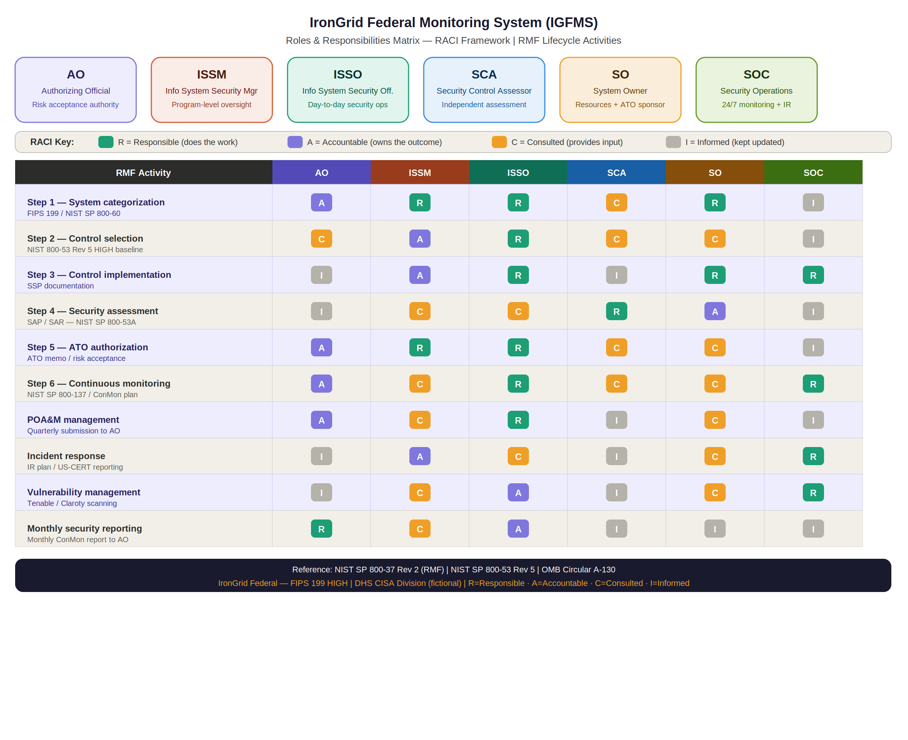

Security Assessment Plan (SAP)
IronGrid Federal Monitoring System (IGFMS)
Document Type: Security Assessment Plan
Version: 1.0
Classification: UNCLASSIFIED // FOR OFFICIAL USE ONLY (FOUO) (fictional)
Date: January 2025
Prepared By: Security Control Assessor (SCA) — CyberAssure Federal LLC (fictional)
Reference: NIST SP 800-53A Rev 5 | NIST SP 800-37 Rev 2
---
1. Purpose and Scope
This Security Assessment Plan (SAP) defines the approach, schedule, and methodology for conducting the annual security control assessment of the IronGrid Federal Monitoring System (IGFMS). The assessment evaluates the extent to which security controls are implemented correctly, operating as intended, and producing the desired outcome with respect to meeting the security requirements for IGFMS.
The scope of this assessment covers all 421 controls selected in the IGFMS controls matrix, with particular depth applied to HIGH-priority control families including AC, AU, IA, SC, SI, IR, and SR.
---

---
2. Assessment Team
Role	Individual	Organization
Lead Security Control Assessor	Dr. Patricia Okonkwo (fictional)	CyberAssure Federal LLC
OT/ICS Specialist Assessor	Marcus Delgado (fictional)	CyberAssure Federal LLC
Penetration Test Lead	Karim Nasser (fictional)	CyberAssure Federal LLC
ISSO (support role)	[Your Name]	DHS CISA IGFMS Program
ISSM (oversight)	Sarah K. Reyes (fictional)	DHS CISA
> Assessment team members are independent of the IGFMS development and operations team to ensure objectivity per NIST SP 800-37 Rev 2.
---
3. Assessment Methodology
Assessment procedures follow NIST SP 800-53A Rev 5 using three assessment methods:
Examine — Review documents, policies, procedures, system configurations, logs, and architecture diagrams to determine control implementation and effectiveness.
Interview — Conduct structured interviews with the ISSO, ISSM, system administrators, SOC personnel, and other stakeholders to verify understanding and execution of security procedures.
Test — Perform technical testing including configuration review, vulnerability scanning, penetration testing, and log analysis to validate control operation.
Each control is assessed at one of three determination values:
Satisfied — Control is implemented and operating as intended
Other Than Satisfied — Control has deficiencies requiring remediation
Not Applicable — Control does not apply to this system
---
4. Assessment Schedule
Phase	Activity	Start	End	Lead
Phase 1	Documentation review	Feb 3	Feb 14	Dr. Okonkwo
Phase 2	Stakeholder interviews	Feb 17	Feb 28	Dr. Okonkwo
Phase 3	Technical configuration review	Mar 3	Mar 14	M. Delgado
Phase 4	OT/ICS specialized assessment	Mar 17	Mar 21	M. Delgado
Phase 5	Penetration testing	Mar 24	Apr 4	K. Nasser
Phase 6	Findings analysis + SAR draft	Apr 7	Apr 18	Dr. Okonkwo
Phase 7	ISSO/ISSM review + finalization	Apr 21	Apr 30	All
---
5. Assessment Focus Areas
5.1 High Priority Controls (Full Assessment)
The following control families receive full depth assessment due to their criticality to IGFMS mission:
Family	Rationale
AC — Access Control	MFA gap (POAM-002) and stale accounts (POAM-006) require verification
AU — Audit & Accountability	SIEM logging gap (POAM-004) requires full coverage verification
IA — Identification & Authentication	PIV enforcement gaps require comprehensive testing
SC — System & Comms Protection	Data diode and boundary controls are mission-critical
SI — System & Information Integrity	Legacy firmware (POAM-001) and FIM effectiveness
IR — Incident Response	IR plan testing gap (POAM-003) requires full verification
SR — Supply Chain Risk	Vendor assessment gaps (POAM-005) require evaluation
5.2 OT/ICS Assessment Scope
The OT/ICS assessment is conducted using passive techniques only. No active scanning, packet injection, or intrusive testing is permitted on the OT network segment. The OT assessment includes physical inspection of data diode appliances, review of OT network architecture documentation, interview of OT system administrators, and review of Claroty passive scan results and vendor advisories.
5.3 Penetration Testing Scope
Penetration testing is scoped to the IT network segment only. OT systems are excluded from active testing. The pentest will target the analyst workstation environment, web-based internal portals, inter-agency connection points, and authentication mechanisms. Rules of engagement will be documented and signed by the AO before testing begins.
---
6. Rules of Engagement
Testing hours: Monday–Friday, 0600–1800 EST (off-peak hours)
OT segment: No active testing permitted under any circumstances
Destructive testing: Prohibited
Social engineering: Excluded from scope
Emergency stop: ISSO or ISSM can halt testing at any time via designated contact
Discovery of critical vulnerabilities: Must be reported to ISSO within 2 hours
---
7. Deliverables
Deliverable	Description	Due Date
SAP (this document)	Assessment plan signed by AO	Jan 31, 2025
Weekly status reports	Progress updates to ISSO/ISSM	Weekly during assessment
Draft SAR	Initial findings report	Apr 18, 2025
Final SAR	Finalized after ISSO review	Apr 30, 2025
Executive Summary	AO briefing package	May 2, 2025
