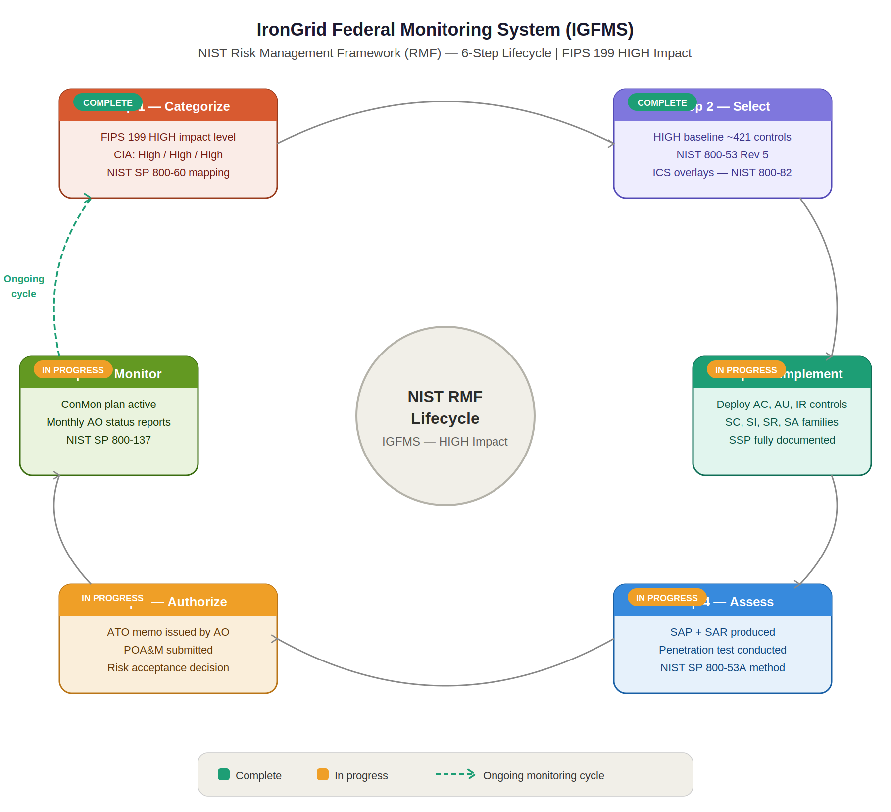

Authority to Operate (ATO) Decision Memorandum
IronGrid Federal Monitoring System (IGFMS)
Document Type: ATO Decision Memorandum
Classification: UNCLASSIFIED // FOR OFFICIAL USE ONLY (FOUO) (fictional)
Date: May 15, 2025
System ID: DHS-CISA-IGFMS-001 (fictional)
---
```
MEMORANDUM FOR: James A. Harlow, System Owner
                Sarah K. Reyes, ISSM
                [Your Name], ISSO

FROM:           Lt. Gen. (Ret.) Marcus T. Webb
                Authorizing Official
                DHS Cybersecurity and Infrastructure Security Agency
                *(fictional)*

SUBJECT:        Authority to Operate — IronGrid Federal Monitoring System (IGFMS)
                System ID: DHS-CISA-IGFMS-001
```
---
1. Authorization Decision
After careful review of the security authorization package for the IronGrid Federal Monitoring System (IGFMS), including the System Security Plan (SSP v2.1), Security Assessment Report (SAR), Plan of Action and Milestones (POA&M), and all supporting documentation, I hereby grant an Authority to Operate (ATO) with Conditions for IGFMS.
ATO Type: Authority to Operate with Conditions
ATO Start Date: May 15, 2025
ATO Expiration Date: May 14, 2028 (3 years)
Next Scheduled Assessment: April 2026
---

---
2. Basis for Decision
This authorization is based on my review and acceptance of the residual risk associated with operating IGFMS. Key factors considered include the following.
Security Control Coverage: Of 421 controls assessed, 87% (368 controls) were found fully satisfied. The remaining controls have active remediation plans in the current POA&M.
Mission Criticality: IGFMS provides irreplaceable real-time situational awareness for national critical infrastructure. The operational necessity of the system, combined with the compensating controls in place, justifies authorization despite the identified deficiencies.
Security Posture Strengths: The assessment identified exceptional physical security, robust OT network segmentation via hardware data diodes, mature privileged access management, comprehensive SIEM coverage, and a well-staffed 24/7 Security Operations Center.
Active Risk Mitigation: All Critical and High findings have active POA&M items with defined remediation timelines and compensating controls in place.
---
3. Authorization Conditions
This ATO is granted subject to the following mandatory conditions. Failure to meet these conditions may result in suspension or revocation of the ATO.
Condition	Due Date	Owner
Complete SCADA firmware remediation (POAM-001)	March 31, 2025	Systems Admin
Complete MFA enrollment for all privileged accounts (POAM-002)	February 28, 2025	IAM Team
Resolve SIEM logging gap (POAM-004)	January 15, 2025	Systems Admin
Complete all 4 vendor SCRM assessments (POAM-005)	March 15, 2025	SCRM Manager
Submit monthly ConMon reports to AO without interruption	Ongoing	ISSO
Conduct quarterly POA&M reviews with ISSM	Ongoing	ISSO
---
4. Residual Risk Acceptance
I accept the following residual risks as documented in the SAR and POA&M:
The legacy SCADA firmware vulnerability (POAM-001) represents elevated risk during the remediation period. Compensating controls including enhanced network segmentation, increased monitoring, and vendor-validated patch testing provide adequate interim protection.
The MFA enrollment gap (POAM-002) for 5 contractor accounts is mitigated by enhanced session monitoring, account usage alerts, and the imminent completion of PIV enrollment.
---
5. Roles and Responsibilities Post-Authorization

The ISSO is responsible for maintaining the continuous monitoring program, submitting monthly ConMon reports, updating the POA&M, and notifying the AO of any significant changes to the security posture of IGFMS. The ISSM is responsible for reviewing ISSO activities and escalating significant risks to the AO. The System Owner is responsible for resourcing all security activities required to maintain this authorization.
---
6. Significant Change Reporting
Any of the following changes must be reported to the AO within 72 hours and may require re-authorization:
Addition of new external interconnections
Significant changes to the system architecture or authorization boundary
Discovery of a new Critical or High vulnerability not currently tracked in the POA&M
A confirmed security incident with national-level impact
Changes to the hosting environment or data center facility
---
7. Authorization Signatures (fictional)
```
___________________________________
Lt. Gen. (Ret.) Marcus T. Webb
Authorizing Official
DHS Cybersecurity and Infrastructure Security Agency
Date: May 15, 2025


___________________________________
Sarah K. Reyes
Information System Security Manager (ISSM)
Date: May 14, 2025


___________________________________
[Your Name]
Information System Security Officer (ISSO)
Date: May 13, 2025


___________________________________
James A. Harlow
System Owner / Deputy Director, Infrastructure Assurance
Date: May 12, 2025
```
---
8. References
NIST SP 800-37 Rev 2 — Risk Management Framework
NIST SP 800-53 Rev 5 — Security and Privacy Controls
FISMA 2014 — Federal Information Security Modernization Act
OMB Circular A-130 — Managing Information as a Strategic Resource
IGFMS SSP v2.1 — January 2025
IGFMS SAR — April 30, 2025
IGFMS POA&M Tracker — Q1 2025
