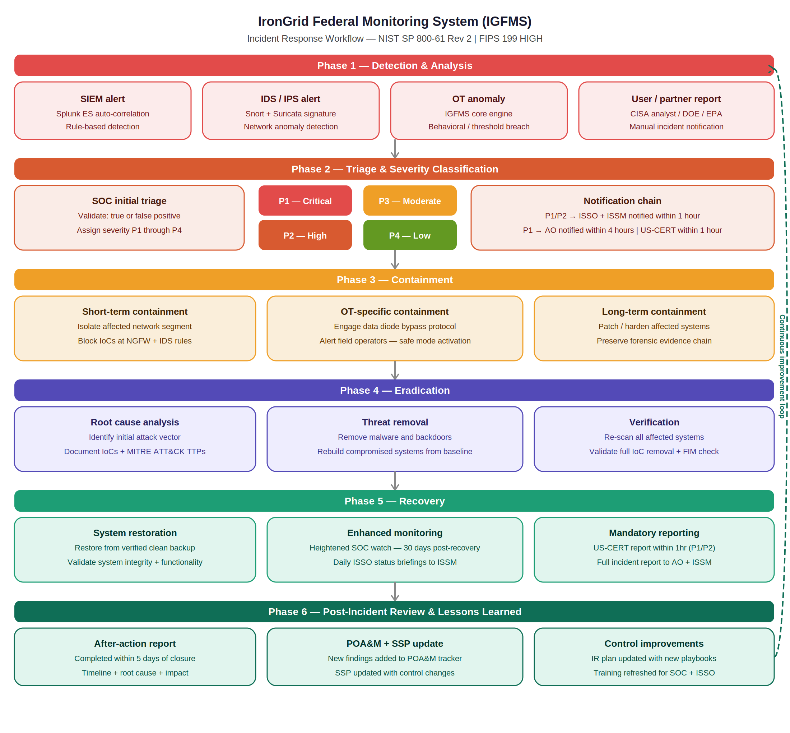

Incident Response Plan (IRP)
IronGrid Federal Monitoring System (IGFMS)
Document Type: Incident Response Plan
Version: 2.0
Classification: UNCLASSIFIED // FOR OFFICIAL USE ONLY (FOUO) (fictional)
Date: January 2025
Reference: NIST SP 800-61 Rev 2 | NIST SP 800-82 Rev 3

---

---
1. Purpose and Scope
This Incident Response Plan (IRP) establishes the procedures, roles, and responsibilities for detecting, responding to, and recovering from cybersecurity incidents affecting the IronGrid Federal Monitoring System (IGFMS). Given IGFMS's role in monitoring national critical infrastructure, all incidents must be handled with the highest urgency and in accordance with federal incident reporting requirements.
This plan applies to all incidents affecting IGFMS components within the authorization boundary, including the OT/ICS sensor network, federal processing core, and analyst tier.
---
2. Incident Classification
Priority	Severity	Description	Response Time
P1	Critical	Active attack on IGFMS or connected critical infrastructure; confirmed data breach; OT system compromise	Immediate — 15 min SOC, 1 hr ISSO/ISSM, 4 hr AO
P2	High	Confirmed malware infection; unauthorized privileged access; significant data loss; OT anomaly confirmed malicious	1 hr SOC, 4 hr ISSO/ISSM, 24 hr AO
P3	Moderate	Suspicious activity under investigation; policy violation; potential unauthorized access	4 hr SOC, 24 hr ISSO
P4	Low	Minor policy violation; false positive confirmed after investigation; informational security event	24–72 hr SOC
---
3. Roles and Responsibilities
Role	Incident Responsibilities
SOC Analyst	Initial detection, triage, severity classification, short-term containment
SOC Incident Commander	P1/P2 coordination, team tasking, status communications
ISSO	Security oversight, AO notification, US-CERT reporting, POA&M update
ISSM	AO liaison, program-level coordination, major incident authorization
AO	P1 notification, risk acceptance decisions, major response authorization
OT Systems Admin	OT-specific containment, field operator coordination, vendor engagement
IAM Team	Account suspension, access revocation, credential reset
Legal/Privacy Officer	Data breach notification requirements, legal holds
---
4. Incident Response Phases
Phase 1 — Preparation
IGFMS maintains the following pre-incident resources to ensure rapid response capability:
Current contact lists for all IR team members, including 24/7 emergency contacts
Pre-approved emergency change procedures for critical containment actions
OT vendor hotline numbers for SCADA equipment emergency support
Forensic investigation toolkits validated and ready in secure storage
Inter-agency liaison contacts at DOE, EPA, and FEMA for OT incident coordination
Splunk SOAR playbooks for automated initial response to known attack patterns
Phase 2 — Detection and Analysis
Detection Sources: SIEM alerts (Splunk ES), IDS/IPS signatures (Snort/Suricata), OT anomaly detection (IGFMS core engine), FIM alerts (Tripwire), user reports, inter-agency notifications.
Initial Analysis Steps:
SOC analyst acknowledges alert within 15 minutes of generation
Analyst validates alert as true or false positive using enrichment data
If true positive confirmed, assign incident priority (P1–P4)
Open incident ticket in tracking system with timestamp, description, and initial indicators
Notify ISSO immediately for all P1 and P2 incidents
OT-Specific Detection: OT anomalies are assessed by OT-qualified SOC personnel only. Any OT anomaly that cannot be ruled out as benign within 30 minutes is escalated to P2 automatically.
Phase 3 — Containment
Short-Term Containment (immediate):
Isolate affected network segment at NGFW to prevent lateral movement
Block identified malicious IPs, domains, and file hashes at perimeter
Revoke credentials of any compromised accounts via CyberArk
For OT incidents: notify field operators and activate safe mode on affected systems
Preserve system state and capture memory images before changes
Long-Term Containment:
Apply additional network segmentation around affected systems
Deploy enhanced monitoring rules targeting identified threat actor TTPs
Patch or harden systems that enabled the initial compromise where operationally feasible
Maintain forensic evidence chain of custody
Phase 4 — Eradication
Conduct root cause analysis to identify the complete attack path
Remove all malware, backdoors, and unauthorized software
Rebuild systems from known-good baselines where compromise is confirmed
Update threat indicators across all detection platforms
Validate eradication through re-scanning and FIM verification
Document all findings using MITRE ATT&CK framework for TTP characterization
Phase 5 — Recovery
Restore affected systems from verified clean backups
Validate system functionality and data integrity before returning to production
Implement enhanced monitoring for 30 days post-recovery
Require additional authentication steps for accounts involved in the incident
Submit mandatory US-CERT incident report within required timeframes
Brief AO and ISSM on incident timeline, impact, and recovery status
Phase 6 — Post-Incident Review
Conduct after-action review within 5 business days of incident closure
Produce after-action report documenting timeline, root cause, impact, and lessons learned
Update IR plan and playbooks based on lessons learned
Add new findings to POA&M if security control gaps are identified
Conduct targeted security awareness training if human error contributed to the incident
Share sanitized threat intelligence with inter-agency partners and ISACs as appropriate
---
5. Mandatory Reporting Requirements
Incident Type	Reporting Requirement	Deadline	Recipient
All P1 incidents	Initial notification	Within 1 hour of confirmation	US-CERT, AO, ISSM
All P1/P2 incidents	Full incident report	Within 72 hours	US-CERT, AO
Privacy/PII breach	Breach notification	Within 1 hour	Privacy Officer, DHS SAOP
OT impact confirmed	Critical infrastructure notification	Within 1 hour	CISA 24/7 Operations
All incidents	After-action report	Within 5 business days of closure	ISSM, AO
---
6. Ransomware-Specific Playbook
Given the elevated ransomware threat to critical infrastructure operators, IGFMS maintains a dedicated ransomware response playbook. Key steps specific to ransomware include:
Immediately isolate all affected systems from the network — do not allow encrypted systems to contact C2 infrastructure
Do not pay ransom without AO, legal, and federal law enforcement coordination
Preserve encrypted files and ransom notes as forensic evidence
Notify FBI and CISA via designated emergency contacts within 1 hour
Begin parallel recovery from clean backups while investigation continues
Check OT segment for any signs of pre-ransomware reconnaissance activity
---
7. Plan Maintenance
This IRP is reviewed and updated annually and after every significant incident. The ISSO is responsible for maintaining currency of this document. All IR team members must review the plan annually and acknowledge receipt.
Review	Date	Reviewer
Annual review	January 2025	[patrickobu], ISSO
Post-incident update	As needed	[patrickobu], ISSO
Next scheduled review	January 2026	[patrickobu], ISSO
